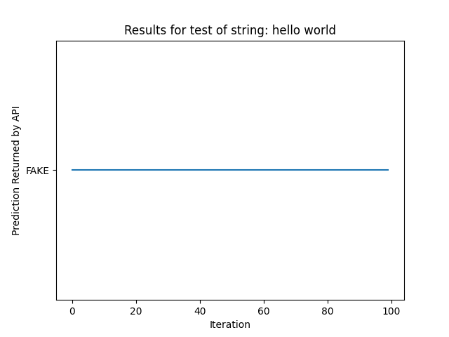
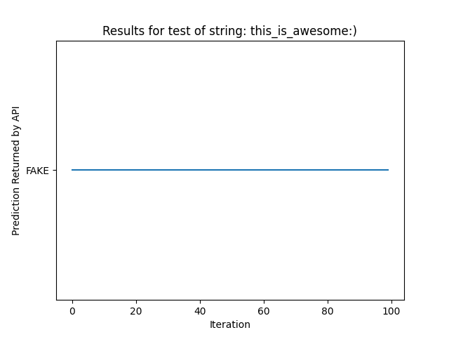
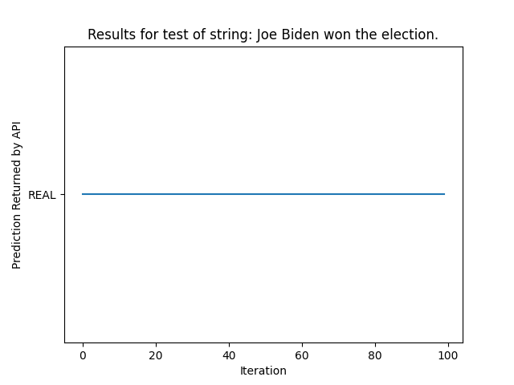

# E444-F2024-PRA2
> Name: Faatima Abidi

## Activity 6: Testing the API
These files were generated by running an automated script called `python testing.py` that I wrote in my terminal

### Boxplot of test case 1 (fake news)

### Boxplot of test case 2 (fake news)

### Boxplot of test case 3 (real news)

### Boxplot of test case 4 (real news)

### Link to csv file containing data of all test cases
[CSV file](./results.csv)
