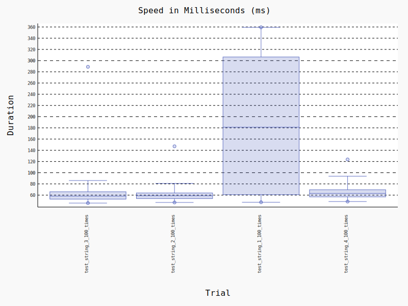

# E444-F2024-PRA2
> Name: Faatima Abidi

## Activity 6: Testing the API

### Boxplot for latency
Boxplot was generated by calling
`python -m pytest --benchmark-histogram`

### Link to csv file containing data of first test case
[CSV file](./results1.csv)

### Link to csv file containing data of second test case
[CSV file](./results2.csv)

### Link to csv file containing data of third test case
[CSV file](./results3.csv)

### Link to csv file containing data of fourth test case
[CSV file](./results4.csv)
